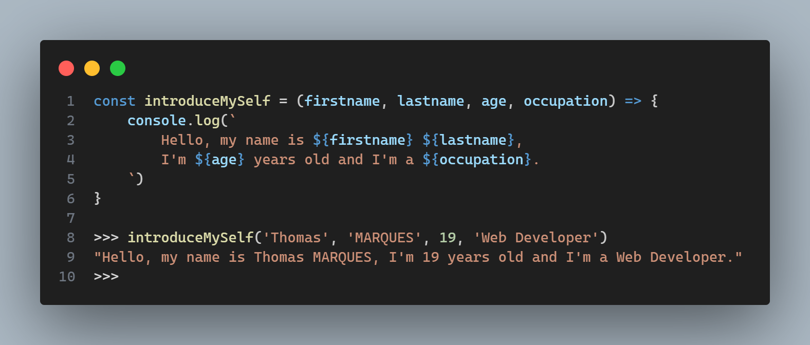

# Bonsoir ! 👋

## Je m'appelle **Thomas Marques** et je suis actuellement étudiant en développement web.

* 🏫 Je suis actuellement en **3ème année** de bachelor à l'[**IIM**](https://iim.fr)
* 📚 J'étudie dans l'axe **Coding & Digital Innovation**
* ❤️ Je suis passionné par le **développement web**
* 💻 J'aspire à devenir **développeur fullstack**

### 📚 Mes technos :

### Mes projets :
* [Portfolio](../../../portfolio-v2) : Portfolio personnel en Vue.js
* [RETWITT](../../../retwitt-project) : Conception d'un réseau social en PHP
* [PokeShop](../../../ecommerce-pokemon) : Site E-commerce fictif de pokémon en JS
* [Mongoo](../../../Rendu-Integration) : Intégration d'une maquette en SCSS
* [Hangman Game](../../../hangman-game) : Jeu du pendu en JS
* [Weather App](../../../weather-app-react) : Application météo en ReactJS
* [Phone App](../../../phone-app-vuejs) : Application de téléphone en Vue.js
* [Epsilon](../../../epsilon) : Bloc notes en Vue.js
* [Lyyda](../../../lyyda) : Plateforme de gestion d'évènements en ReactJS

### 🌐 Portfolio :
https://www.thomasmarques.fr

### 📧 Mail :
* **thomasmarques.lucky@gmail.com**

### 🔗 Réseaux sociaux :

